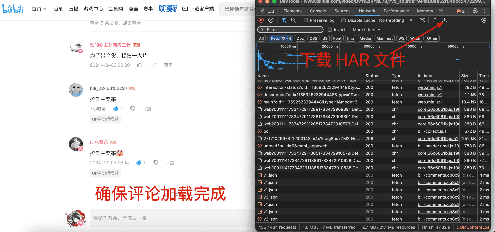
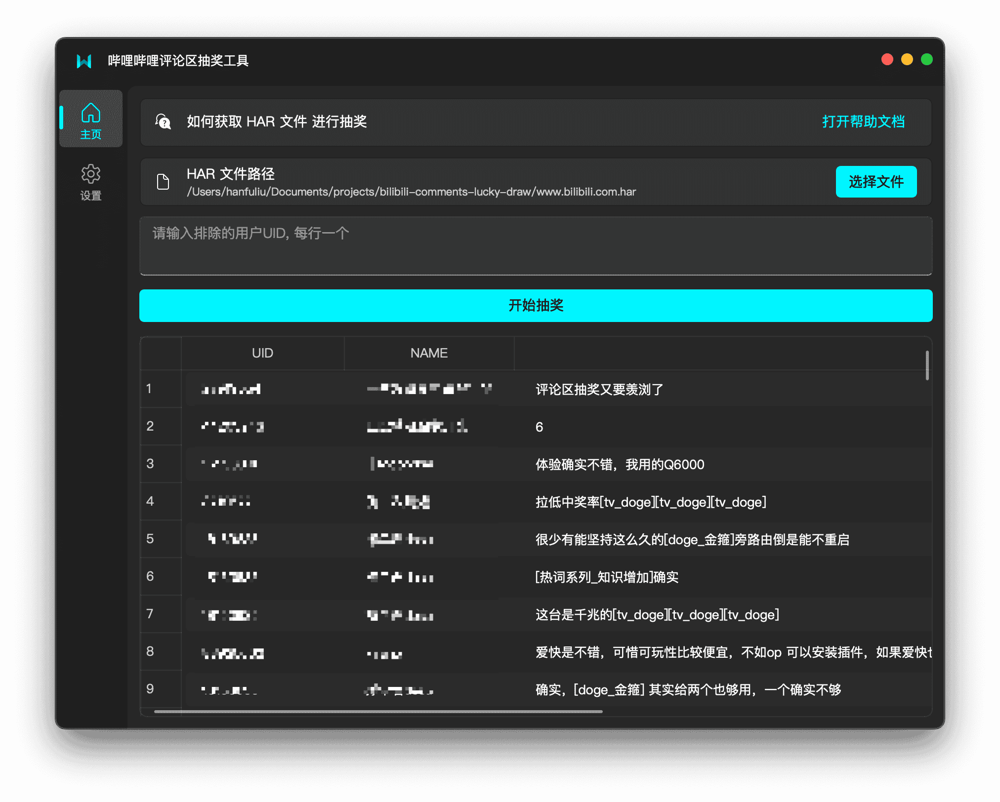

# 哔哩哔哩评论区抽奖工具

- 使用浏览器保存评论区 HAR 文件
- 从第一层评论中抽取评论

## 使用

到 [Release 页面](https://github.com/dreamhunter2333/bilibili-comments-lucky-draw/releases) 下载对应的安装包，macos 版本打开很慢，需要等待一段时间。

浏览器打开F12控制台的 `network` 页面, 然后打开某个哔哩哔哩视频，查看评论区滑动到最底部，点击下图图标保存 HAR 文件。



然后打开软件，点击 `选择文件` 按钮，选择刚刚保存的 HAR 文件，然后点击 `开始` 按钮，然后点击开始抽奖。



## 开发

### mac

```bash
python3 -m venv ./venv
./venv/bin/python3 -m pip install -r requirements.txt
# 运行
./venv/bin/python3 main.py
# 打包
./venv/bin/pyinstaller -F -w -i main.icns main.py -p har_parser.py -p home_interface.py -p setting_interface.py -n 哔哩哔哩评论区抽奖工具
```

### win

```bash
python -m venv ./venv
.\venv\Scripts\python -m pip install -r requirements.txt
# 运行
.\venv\Scripts\python main.py
# 打包
.\venv\Scripts\pyinstaller.exe -F -w -i main.ico main.py -p har_parser.py -p home_interface.py -p setting_interface.py -n 哔哩哔哩评论区抽奖工具
```
